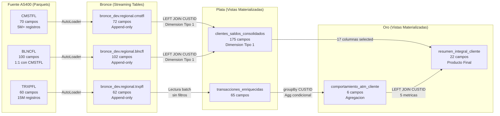

# Modelado de Datos — Pipeline LSDP Laboratorio Basico

**Proyecto**: LakeflowSparkDeclarativePipelinesBase
**Arquitectura**: Medallion (Parquets AS400 / Bronce / Plata / Oro)
**Total de entidades documentadas**: 10 (3 parquets fuente, 3 streaming tables, 2 vistas plata, 2 vistas oro)
**Fecha**: 2026-04-01

Este documento es el diccionario de datos del pipeline LSDP. Documenta todas las entidades de datos organizadas por capa del medallion, con nombre completo, columnas, tipos de dato, descripciones y logica de los campos calculados.

---

## Linaje de Datos

### Diagrama de Flujo

### Relaciones y Claves

| Relacion | Clave | Tipo de JOIN | Descripcion |
|----------|-------|--------------|-------------|
| CMSTFL -> cmstfl | — | AutoLoader streaming | Ingesta incremental append-only |
| TRXPFL -> trxpfl | — | AutoLoader streaming | Ingesta incremental append-only |
| BLNCFL -> blncfl | — | AutoLoader streaming | Ingesta incremental append-only |
| cmstfl + blncfl -> csc | CUSTID | LEFT JOIN | Todos los clientes del maestro; saldos pueden ser nulos |
| trxpfl -> te | — | Lectura batch | Renombramiento y enrichment de columnas |
| te -> atm | CUSTID (groupBy) | Agregacion | Una fila por cliente con metricas ATM |
| csc + atm -> ric | identificador_cliente | LEFT JOIN | Todos los clientes de plata; metricas ATM coalesce a 0 |

**Clave universal**: `CUSTID` en las capas AS400 y Bronce, renombrado a `identificador_cliente` a partir de la capa Plata.

---

## Archivos Parquet — Fuente AS400

Los parquets simulan los archivos exportados desde AS400. Son la unica fuente de datos del pipeline. Se almacenan en ADLS Gen2 bajo el contenedor `bronce` en rutas configuradas como parametros del pipeline.

### CMSTFL — Maestro de Clientes (70 campos)

**Archivo**: MaestroCliente (generado por `NbGenerarMaestroCliente.py`)
**Clave primaria**: CUSTID
**Volumetria**: 5.000.000 registros base + 0,60% incremental por re-ejecucion
**Relaciones**: CUSTID es clave foranea en TRXPFL y BLNCFL

| Campo AS400 | Tipo | Descripcion |
|-------------|------|-------------|
| CUSTID | LongType | Identificador unico del cliente |
| CUSTNM | StringType | Nombre completo del cliente (FRSTNM + LSTNM concatenados) |
| FRSTNM | StringType | Primer nombre |
| MDLNM | StringType | Segundo nombre |
| LSTNM | StringType | Primer apellido |
| SCNDLN | StringType | Segundo apellido |
| GNDR | StringType | Genero (M/F) |
| IDTYPE | StringType | Tipo de documento de identidad |
| IDNMBR | StringType | Numero de documento de identidad |
| NATNLT | StringType | Codigo de nacionalidad (ISO 3166) |
| MRTLST | StringType | Estado civil (S=Soltero, C=Casado, D=Divorciado, V=Viudo) |
| ADDR1 | StringType | Direccion — linea 1 |
| ADDR2 | StringType | Direccion — linea 2 |
| CITY | StringType | Ciudad de residencia |
| STATE | StringType | Estado o provincia de residencia |
| ZPCDE | StringType | Codigo postal |
| CNTRY | StringType | Pais de residencia (ISO 3166) |
| PHONE1 | StringType | Telefono principal |
| PHONE2 | StringType | Telefono secundario |
| EMAIL | StringType | Correo electronico |
| OCCPTN | StringType | Ocupacion o profesion |
| EMPLYR | StringType | Nombre del empleador |
| EMPADS | StringType | Direccion del empleador |
| BRNCOD | StringType | Codigo de la sucursal de apertura |
| BRNNM | StringType | Nombre de la sucursal de apertura |
| SGMNT | StringType | Segmento del cliente (VIP/PREM/STD/BAS) |
| CSTCAT | StringType | Categoria del cliente |
| RISKLV | StringType | Nivel de riesgo asignado (01 a 05) |
| PRDTYP | StringType | Tipo de producto principal contratado |
| ACCTST | StringType | Estado de la cuenta (AC=Activo, IN=Inactivo, CL=Cerrado, SU=Suspendido) |
| TXID | StringType | Identificador fiscal del cliente |
| LGLLNM | StringType | Nombre legal completo |
| MTHNM | StringType | Nombre de la madre |
| FTHNM | StringType | Nombre del padre |
| CNTPRS | StringType | Persona de contacto de emergencia |
| CNTPH | StringType | Telefono del contacto de emergencia |
| PREFNM | StringType | Nombre preferido del cliente |
| LANG | StringType | Idioma preferido para comunicaciones |
| EDLVL | StringType | Nivel educativo alcanzado |
| INCSRC | StringType | Fuente principal de ingresos |
| RELTYP | StringType | Tipo de relacion bancaria |
| NTFPRF | StringType | Preferencia de canal de notificacion |
| BRTDT | DateType | Fecha de nacimiento |
| OPNDT | DateType | Fecha de apertura de la cuenta |
| LSTTRX | DateType | Fecha de la ultima transaccion registrada |
| LSTUPD | DateType | Fecha de la ultima actualizacion del registro |
| CRTNDT | DateType | Fecha de creacion del registro en el sistema |
| EXPDT | DateType | Fecha de vencimiento del documento de identidad |
| EMPSDT | DateType | Fecha de inicio del empleo actual |
| LSTLGN | DateType | Fecha del ultimo acceso al canal digital |
| RVWDT | DateType | Fecha de la ultima revision KYC |
| VLDDT | DateType | Fecha de validacion de datos del cliente |
| ENRLDT | DateType | Fecha de enrolamiento en el canal digital |
| CNCLDT | DateType | Fecha de cancelacion del cliente en el maestro |
| RJCTDT | DateType | Fecha de rechazo de solicitud o producto |
| PRMDT | DateType | Fecha de promocion al segmento actual |
| CHGDT | DateType | Fecha del ultimo cambio de estado de la cuenta |
| LSTCDT | DateType | Fecha del ultimo contacto registrado |
| NXTRVW | DateType | Fecha programada para la proxima revision |
| BKRLDT | DateType | Fecha de inicio de la relacion con el banco |
| ANNLINC | DoubleType | Ingreso anual declarado por el cliente |
| MNTHINC | DoubleType | Ingreso mensual estimado |
| CRDSCR | LongType | Puntaje crediticio (0 a 1000) |
| DPNDNT | LongType | Numero de dependientes economicos |
| TTLPRD | LongType | Total de productos financieros contratados |
| FNCLYR | LongType | Ano fiscal vigente del cliente |
| AGECST | LongType | Edad del cliente en anos |
| YRBNKG | LongType | Anos de relacion con el banco |
| RSKSCR | DoubleType | Score de riesgo calculado por el modelo |
| NUMPHN | LongType | Cantidad de telefonos registrados en el sistema |

### TRXPFL — Transaccional (60 campos)

**Archivo**: Transaccional (generado por `NbGenerarTransaccionalCliente.py`)
**Clave foranea**: CUSTID (referencia a CMSTFL)
**Volumetria**: 15.000.000 de registros nuevos por cada ejecucion

| Campo AS400 | Tipo | Descripcion |
|-------------|------|-------------|
| TRXID | LongType | Identificador unico de la transaccion |
| CUSTID | LongType | Identificador del cliente (FK a CMSTFL) |
| TRXTYP | StringType | Codigo del tipo de transaccion (CATM/DATM/CMPR/TINT/DPST/PGSL/TEXT/RTRO/PGSV/NMNA/INTR/ADSL/IMPT/DMCL/CMSN) |
| TRXDSC | StringType | Descripcion textual del tipo de transaccion |
| CHNLCD | StringType | Canal de la transaccion (ATM/POS/WEB/MOB/SUC) |
| TRXSTS | StringType | Estado de la transaccion (APP/PEN/REV/ERR) |
| CRNCOD | StringType | Codigo de moneda (ISO 4217, ej: USD/EUR) |
| BRNCOD | StringType | Codigo de la sucursal que proceso la transaccion |
| ATMID | StringType | Identificador del cajero automatico (si aplica) |
| TRXDT | DateType | Fecha de la transaccion |
| TRXTM | TimestampType | Fecha y hora completa de la transaccion |
| PRCDT | DateType | Fecha de procesamiento batch |
| PRCTM | TimestampType | Fecha y hora de procesamiento batch |
| VLDT | DateType | Fecha valor de la transaccion |
| STLDT | DateType | Fecha de liquidacion |
| PSTDT | DateType | Fecha de contabilizacion en libros |
| CRTDT | DateType | Fecha de creacion del registro en el sistema |
| LSTUDT | DateType | Fecha de la ultima actualizacion del registro |
| AUTHDT | DateType | Fecha de autorizacion de la transaccion |
| CNFRDT | DateType | Fecha de confirmacion |
| EXPDT | DateType | Fecha de expiracion de la autorizacion |
| RVRSDT | DateType | Fecha de reverso (si la transaccion fue revertida) |
| RCLDT | DateType | Fecha de reconciliacion |
| NTFDT | DateType | Fecha de notificacion al cliente |
| CLRDT | DateType | Fecha de compensacion interbancaria |
| DSPDT | DateType | Fecha de apertura de disputa |
| RSLTDT | DateType | Fecha de resolucion de la disputa |
| BTCHDT | DateType | Fecha del lote de procesamiento |
| EFCDT | DateType | Fecha efectiva de la transaccion |
| ARCDT | DateType | Fecha de archivado del registro |
| TRXAMT | DoubleType | Monto de la transaccion |
| ORGAMT | DoubleType | Monto original antes de conversion o ajuste |
| FEEAMT | DoubleType | Monto de comision aplicada |
| TAXAMT | DoubleType | Monto de impuesto aplicado |
| NETAMT | DoubleType | Monto neto despues de comisiones e impuestos |
| BLNBFR | DoubleType | Saldo de la cuenta antes de la transaccion |
| BLNAFT | DoubleType | Saldo de la cuenta despues de la transaccion |
| XCHGRT | DoubleType | Tasa de cambio aplicada |
| CVTAMT | DoubleType | Monto convertido a moneda local |
| INTAMT | DoubleType | Monto de intereses asociado |
| DSCAMT | DoubleType | Monto de descuento aplicado |
| PNLAMT | DoubleType | Monto de penalidad aplicada |
| REFAMT | DoubleType | Monto de referencia para el calculo |
| LIMAMT | DoubleType | Limite permitido para este tipo de transaccion |
| AVLAMT | DoubleType | Monto disponible al momento de la transaccion |
| HLDAMT | DoubleType | Monto retenido o en espera de liquidacion |
| OVRAMT | DoubleType | Monto de sobregiro utilizado |
| MINAMT | DoubleType | Monto minimo requerido para la operacion |
| MAXAMT | DoubleType | Monto maximo permitido para la operacion |
| AVGAMT | DoubleType | Monto promedio diario en el canal |
| CSHREC | DoubleType | Monto recibido en efectivo |
| CSHGVN | DoubleType | Monto entregado en efectivo |
| TIPAMT | DoubleType | Monto de propina (en transacciones POS) |
| RNDAMT | DoubleType | Monto de redondeo aplicado |
| SURCHG | DoubleType | Recargo adicional (uso de red externa, etc.) |
| INSAMT | DoubleType | Monto de seguro asociado a la transaccion |
| ADJAMT | DoubleType | Monto de ajuste posterior a la transaccion |
| DLYACM | DoubleType | Acumulado de montos en el canal en el dia |
| WKACM | DoubleType | Acumulado de montos en el canal en la semana |
| MTHACM | DoubleType | Acumulado de montos en el canal en el mes |

### BLNCFL — Saldos de Clientes (100 campos)

**Archivo**: SaldoCliente (generado por `NbGenerarSaldosCliente.py`)
**Clave foranea**: CUSTID (referencia a CMSTFL)
**Volumetria**: Exactamente 1 registro por cada cliente del Maestro (relacion 1:1)

| Campo AS400 | Tipo | Descripcion |
|-------------|------|-------------|
| CUSTID | LongType | Identificador del cliente (FK a CMSTFL) |
| ACCTID | StringType | Identificador unico de la cuenta financiera |
| ACCTTYP | StringType | Tipo de cuenta (AHRO=Ahorro, CRTE=Corriente, PRES=Prestamo, INVR=Inversion) |
| ACCTNM | StringType | Nombre descriptivo de la cuenta |
| ACCTST | StringType | Estado de la cuenta (AC/IN/BL/CN) |
| CRNCOD | StringType | Codigo de moneda de la cuenta (ISO 4217) |
| BRNCOD | StringType | Codigo de la sucursal administradora |
| BRNNM | StringType | Nombre de la sucursal administradora |
| PRDCOD | StringType | Codigo del producto financiero |
| PRDNM | StringType | Nombre del producto financiero |
| PRDCAT | StringType | Categoria del producto (AHRB/AHRP/CRTB/PRSP/etc.) |
| SGMNT | StringType | Segmento de la cuenta (PERS/PYME/CORP/PRIV) |
| RISKLV | StringType | Nivel de riesgo de la cuenta (01 a 05) |
| RGNCD | StringType | Codigo de la region geografica |
| RGNNM | StringType | Nombre de la region geografica |
| CSTGRP | StringType | Grupo de cliente asignado a la cuenta |
| BLKST | StringType | Estado de bloqueo de la cuenta (SI/NO) |
| EMBST | StringType | Estado de embargo de la cuenta (SI/NO) |
| OVDST | StringType | Estado de mora de la cuenta (SI/NO) |
| DGTST | StringType | Estado del acceso digital habilitado (SI/NO) |
| CRDST | StringType | Estado crediticio de la cuenta |
| LNTYP | StringType | Tipo de linea de credito (RVLV/FIJA/ADMN/NONE) |
| GRNTYP | StringType | Tipo de garantia (REAL/PRND/FIDC/NONE) |
| PYMFRQ | StringType | Frecuencia de pago (MEN/QUI/SEM/ANU) |
| INTTYP | StringType | Tipo de tasa de interes (FIJ/VAR/MIX) |
| TXCTG | StringType | Categoria fiscal de la cuenta |
| CHKTYP | StringType | Tipo de chequera asociada (si aplica) |
| CRDGRP | StringType | Grupo crediticio interno |
| CLSCD | StringType | Codigo de clasificacion contable |
| SRCCD | StringType | Codigo fuente de originacion |
| AVLBAL | DoubleType | Saldo disponible para uso inmediato |
| CURBAL | DoubleType | Saldo actual de la cuenta |
| HLDBAL | DoubleType | Saldo retenido en espera de acreditacion |
| OVRBAL | DoubleType | Saldo total en sobregiro |
| PNDBAL | DoubleType | Saldo pendiente de confirmacion |
| AVGBAL | DoubleType | Saldo promedio del periodo actual |
| MINBAL | DoubleType | Saldo minimo registrado en el periodo |
| MAXBAL | DoubleType | Saldo maximo registrado en el periodo |
| OPNBAL | DoubleType | Saldo al inicio del periodo |
| CLSBAL | DoubleType | Saldo al cierre del periodo |
| INTACC | DoubleType | Total de intereses acumulados en el periodo |
| INTPAY | DoubleType | Total de intereses pagados en el periodo |
| INTRCV | DoubleType | Total de intereses recibidos (en cuentas de ahorro/inversion) |
| FEEACC | DoubleType | Total de comisiones acumuladas en el periodo |
| FEEPAY | DoubleType | Total de comisiones pagadas en el periodo |
| CRDLMT | DoubleType | Limite total de credito autorizado |
| CRDAVL | DoubleType | Credito disponible para uso |
| CRDUSD | DoubleType | Credito utilizado a la fecha |
| PYMAMT | DoubleType | Monto del pago minimo requerido |
| PYMLST | DoubleType | Monto del ultimo pago realizado |
| TTLDBT | DoubleType | Total de debitos del periodo |
| TTLCRD | DoubleType | Total de creditos del periodo |
| TTLTRX | LongType | Total de transacciones en el periodo |
| LNAMT | DoubleType | Monto original del prestamo |
| LNBAL | DoubleType | Saldo pendiente del prestamo |
| MTHPYM | DoubleType | Cuota mensual del prestamo |
| INTRT | DoubleType | Tasa de interes vigente (porcentaje anual) |
| PNLRT | DoubleType | Tasa de penalidad por incumplimiento |
| OVRRT | DoubleType | Tasa de interes por sobregiro |
| TAXAMT | DoubleType | Total de impuestos acumulados en el periodo |
| INSAMT | DoubleType | Total de seguros acumulados en el periodo |
| DLYINT | DoubleType | Interes diario generado |
| YLDRT | DoubleType | Tasa de rendimiento de la cuenta |
| SPRDRT | DoubleType | Spread aplicado sobre la tasa de referencia |
| MRGAMT | DoubleType | Monto del margen de garantia |
| OPNDT | DateType | Fecha de apertura de la cuenta |
| CLSDT | DateType | Fecha de cierre de la cuenta (si aplica) |
| LSTTRX | DateType | Fecha de la ultima transaccion en la cuenta |
| LSTPYM | DateType | Fecha del ultimo pago realizado |
| NXTPYM | DateType | Fecha del proximo pago programado |
| MATDT | DateType | Fecha de vencimiento del producto |
| RNWDT | DateType | Fecha de renovacion del contrato |
| RVWDT | DateType | Fecha de la ultima revision de condiciones |
| CRTDT | DateType | Fecha de creacion del registro de saldo |
| UPDDT | DateType | Fecha de la ultima actualizacion del saldo |
| STMDT | DateType | Fecha de emision del ultimo estado de cuenta |
| CUTDT | DateType | Fecha de corte del periodo de facturacion |
| GRPDT | DateType | Fecha de fin del periodo de gracia |
| INTDT | DateType | Fecha del ultimo calculo de intereses |
| FEEDT | DateType | Fecha del ultimo cobro de comisiones |
| BLKDT | DateType | Fecha en que se aplico el bloqueo (si aplica) |
| EMBDT | DateType | Fecha en que se aplico el embargo (si aplica) |
| OVDDT | DateType | Fecha de inicio de la condicion de mora |
| PYMDT1 | DateType | Fecha del primer pago del periodo |
| PYMDT2 | DateType | Fecha del segundo pago del periodo |
| PRJDT | DateType | Fecha de proyeccion financiera |
| ADJDT | DateType | Fecha del ultimo ajuste de saldo |
| RCLDT | DateType | Fecha de la ultima reconciliacion |
| NTFDT | DateType | Fecha de la ultima notificacion de saldo |
| CNCLDT | DateType | Fecha de cancelacion de la cuenta |
| RCTDT | DateType | Fecha de reactivacion de la cuenta |
| CHGDT | DateType | Fecha del ultimo cambio de condiciones del contrato |
| VRFDT | DateType | Fecha de la ultima verificacion de datos |
| PRMDT | DateType | Fecha de la ultima promocion aplicada a la cuenta |
| DGTDT | DateType | Fecha del ultimo acceso digital a la cuenta |
| AUDT | DateType | Fecha de la ultima auditoria de la cuenta |
| MGRDT | DateType | Fecha de migracion del registro al sistema actual |
| ESCDT | DateType | Fecha del ultimo escalamiento registrado |
| RPTDT | DateType | Fecha del ultimo reporte regulatorio generado |
| ARCDT | DateType | Fecha de archivado del registro historico |

---

## Streaming Tables de Bronce

Las tablas de bronce ingestan los parquets AS400 usando AutoLoader en modo streaming con acumulacion historica. Cada tabla tiene dos columnas adicionales respecto al parquet fuente:

- **FechaIngestaDatos** (TimestampType): marca de tiempo generada con `current_timestamp()` en el momento en que AutoLoader procesa el archivo. Permite acumulacion historica y es columna del Liquid Cluster en cmstfl y blncfl.
- **_rescued_data** (StringType): columna automatica de AutoLoader que captura datos que no encajan en el esquema inferido (campos con tipo incorrecto, campos extra no reconocidos).

### bronce_dev.regional.cmstfl (72 campos)

**Script**: `LsdpBronceCmstfl.py` | **Decorador**: `@dp.table`
**Columnas del Liquid Cluster**: `FechaIngestaDatos`, `CUSTID`
**Acumulacion**: Append-only historica — cada lote de parquets nuevos agrega filas sin sobreescribir las anteriores

| Campo | Tipo | Descripcion |
|-------|------|-------------|
| FechaIngestaDatos | TimestampType | Marca de tiempo de ingesta con current_timestamp(). Primera columna del Liquid Cluster |
| CUSTID | LongType | Identificador unico del cliente. Segunda columna del Liquid Cluster |
| CUSTNM | StringType | Nombre completo del cliente |
| FRSTNM | StringType | Primer nombre |
| MDLNM | StringType | Segundo nombre |
| LSTNM | StringType | Primer apellido |
| SCNDLN | StringType | Segundo apellido |
| GNDR | StringType | Genero (M/F) |
| IDTYPE | StringType | Tipo de documento de identidad |
| IDNMBR | StringType | Numero de documento de identidad |
| NATNLT | StringType | Codigo de nacionalidad |
| MRTLST | StringType | Estado civil |
| ADDR1 | StringType | Direccion linea 1 |
| ADDR2 | StringType | Direccion linea 2 |
| CITY | StringType | Ciudad de residencia |
| STATE | StringType | Estado o provincia |
| ZPCDE | StringType | Codigo postal |
| CNTRY | StringType | Pais de residencia |
| PHONE1 | StringType | Telefono principal |
| PHONE2 | StringType | Telefono secundario |
| EMAIL | StringType | Correo electronico |
| OCCPTN | StringType | Ocupacion o profesion |
| EMPLYR | StringType | Nombre del empleador |
| EMPADS | StringType | Direccion del empleador |
| BRNCOD | StringType | Codigo de la sucursal de apertura |
| BRNNM | StringType | Nombre de la sucursal de apertura |
| SGMNT | StringType | Segmento del cliente |
| CSTCAT | StringType | Categoria del cliente |
| RISKLV | StringType | Nivel de riesgo (01-05) |
| PRDTYP | StringType | Tipo de producto principal |
| ACCTST | StringType | Estado de la cuenta |
| TXID | StringType | Identificador fiscal |
| LGLLNM | StringType | Nombre legal completo |
| MTHNM | StringType | Nombre de la madre |
| FTHNM | StringType | Nombre del padre |
| CNTPRS | StringType | Persona de contacto de emergencia |
| CNTPH | StringType | Telefono del contacto de emergencia |
| PREFNM | StringType | Nombre preferido |
| LANG | StringType | Idioma preferido |
| EDLVL | StringType | Nivel educativo |
| INCSRC | StringType | Fuente de ingresos |
| RELTYP | StringType | Tipo de relacion bancaria |
| NTFPRF | StringType | Preferencia de notificacion |
| BRTDT | DateType | Fecha de nacimiento |
| OPNDT | DateType | Fecha de apertura de cuenta |
| LSTTRX | DateType | Fecha de ultima transaccion |
| LSTUPD | DateType | Fecha de ultima actualizacion |
| CRTNDT | DateType | Fecha de creacion del registro |
| EXPDT | DateType | Fecha de vencimiento del documento |
| EMPSDT | DateType | Fecha de inicio de empleo |
| LSTLGN | DateType | Fecha de ultimo login digital |
| RVWDT | DateType | Fecha de revision KYC |
| VLDDT | DateType | Fecha de validacion de datos |
| ENRLDT | DateType | Fecha de enrolamiento digital |
| CNCLDT | DateType | Fecha de cancelacion |
| RJCTDT | DateType | Fecha de rechazo |
| PRMDT | DateType | Fecha de promocion de segmento |
| CHGDT | DateType | Fecha de cambio de estado |
| LSTCDT | DateType | Fecha de ultimo contacto |
| NXTRVW | DateType | Fecha de proxima revision |
| BKRLDT | DateType | Fecha de relacion con el banco |
| ANNLINC | DoubleType | Ingreso anual declarado |
| MNTHINC | DoubleType | Ingreso mensual |
| CRDSCR | LongType | Puntaje crediticio |
| DPNDNT | LongType | Numero de dependientes |
| TTLPRD | LongType | Total de productos contratados |
| FNCLYR | LongType | Ano fiscal vigente |
| AGECST | LongType | Edad del cliente |
| YRBNKG | LongType | Anos de relacion bancaria |
| RSKSCR | DoubleType | Score de riesgo calculado |
| NUMPHN | LongType | Cantidad de telefonos registrados |
| _rescued_data | StringType | Datos rescatados por AutoLoader fuera del esquema inferido |

### bronce_dev.regional.trxpfl (62 campos)

**Script**: `LsdpBronceTrxpfl.py` | **Decorador**: `@dp.table`
**Columnas del Liquid Cluster**: `TRXDT`, `CUSTID`, `TRXTYP`
**Acumulacion**: Append-only historica

| Campo | Tipo | Descripcion |
|-------|------|-------------|
| TRXDT | DateType | Fecha de la transaccion. Primera columna del Liquid Cluster |
| CUSTID | LongType | Identificador del cliente. Segunda columna del Liquid Cluster |
| TRXTYP | StringType | Tipo de transaccion. Tercera columna del Liquid Cluster |
| TRXID | LongType | Identificador unico de la transaccion |
| TRXDSC | StringType | Descripcion del tipo de transaccion |
| CHNLCD | StringType | Canal de la transaccion |
| TRXSTS | StringType | Estado de la transaccion |
| CRNCOD | StringType | Codigo de moneda |
| BRNCOD | StringType | Codigo de la sucursal |
| ATMID | StringType | Identificador del cajero automatico |
| TRXTM | TimestampType | Fecha y hora completa de la transaccion |
| PRCDT | DateType | Fecha de procesamiento |
| PRCTM | TimestampType | Fecha y hora de procesamiento |
| VLDT | DateType | Fecha valor |
| STLDT | DateType | Fecha de liquidacion |
| PSTDT | DateType | Fecha de contabilizacion |
| CRTDT | DateType | Fecha de creacion del registro |
| LSTUDT | DateType | Fecha de ultima actualizacion |
| AUTHDT | DateType | Fecha de autorizacion |
| CNFRDT | DateType | Fecha de confirmacion |
| EXPDT | DateType | Fecha de expiracion |
| RVRSDT | DateType | Fecha de reverso |
| RCLDT | DateType | Fecha de reconciliacion |
| NTFDT | DateType | Fecha de notificacion |
| CLRDT | DateType | Fecha de compensacion |
| DSPDT | DateType | Fecha de disputa |
| RSLTDT | DateType | Fecha de resolucion |
| BTCHDT | DateType | Fecha de lote de procesamiento |
| EFCDT | DateType | Fecha efectiva |
| ARCDT | DateType | Fecha de archivado |
| TRXAMT | DoubleType | Monto de la transaccion |
| ORGAMT | DoubleType | Monto original |
| FEEAMT | DoubleType | Monto de comision |
| TAXAMT | DoubleType | Monto de impuesto |
| NETAMT | DoubleType | Monto neto |
| BLNBFR | DoubleType | Saldo antes de la transaccion |
| BLNAFT | DoubleType | Saldo despues de la transaccion |
| XCHGRT | DoubleType | Tasa de cambio |
| CVTAMT | DoubleType | Monto convertido |
| INTAMT | DoubleType | Monto de intereses |
| DSCAMT | DoubleType | Monto de descuento |
| PNLAMT | DoubleType | Monto de penalidad |
| REFAMT | DoubleType | Monto de referencia |
| LIMAMT | DoubleType | Limite permitido |
| AVLAMT | DoubleType | Monto disponible |
| HLDAMT | DoubleType | Monto retenido |
| OVRAMT | DoubleType | Monto de sobregiro |
| MINAMT | DoubleType | Monto minimo requerido |
| MAXAMT | DoubleType | Monto maximo permitido |
| AVGAMT | DoubleType | Monto promedio diario |
| CSHREC | DoubleType | Monto recibido en efectivo |
| CSHGVN | DoubleType | Monto entregado en efectivo |
| TIPAMT | DoubleType | Monto de propina |
| RNDAMT | DoubleType | Monto de redondeo |
| SURCHG | DoubleType | Recargo adicional |
| INSAMT | DoubleType | Monto de seguro |
| ADJAMT | DoubleType | Monto de ajuste |
| DLYACM | DoubleType | Acumulado diario |
| WKACM | DoubleType | Acumulado semanal |
| MTHACM | DoubleType | Acumulado mensual |
| FechaIngestaDatos | TimestampType | Marca de tiempo de ingesta con current_timestamp() |
| _rescued_data | StringType | Datos rescatados por AutoLoader fuera del esquema inferido |

### bronce_dev.regional.blncfl (102 campos)

**Script**: `LsdpBronceBlncfl.py` | **Decorador**: `@dp.table`
**Columnas del Liquid Cluster**: `FechaIngestaDatos`, `CUSTID`
**Acumulacion**: Append-only historica

| Campo | Tipo | Descripcion |
|-------|------|-------------|
| FechaIngestaDatos | TimestampType | Marca de tiempo de ingesta con current_timestamp(). Primera columna del Liquid Cluster |
| CUSTID | LongType | Identificador del cliente. Segunda columna del Liquid Cluster |
| ACCTID | StringType | Identificador de la cuenta |
| ACCTTYP | StringType | Tipo de cuenta |
| ACCTNM | StringType | Nombre descriptivo de la cuenta |
| ACCTST | StringType | Estado de la cuenta |
| CRNCOD | StringType | Codigo de moneda |
| BRNCOD | StringType | Codigo de sucursal |
| BRNNM | StringType | Nombre de la sucursal |
| PRDCOD | StringType | Codigo de producto |
| PRDNM | StringType | Nombre del producto |
| PRDCAT | StringType | Categoria del producto |
| SGMNT | StringType | Segmento de la cuenta |
| RISKLV | StringType | Nivel de riesgo de la cuenta |
| RGNCD | StringType | Codigo de region |
| RGNNM | StringType | Nombre de region |
| CSTGRP | StringType | Grupo del cliente |
| BLKST | StringType | Estado de bloqueo |
| EMBST | StringType | Estado de embargo |
| OVDST | StringType | Estado de mora |
| DGTST | StringType | Estado digital |
| CRDST | StringType | Estado crediticio |
| LNTYP | StringType | Tipo de linea de credito |
| GRNTYP | StringType | Tipo de garantia |
| PYMFRQ | StringType | Frecuencia de pago |
| INTTYP | StringType | Tipo de tasa de interes |
| TXCTG | StringType | Categoria fiscal |
| CHKTYP | StringType | Tipo de chequera |
| CRDGRP | StringType | Grupo crediticio |
| CLSCD | StringType | Codigo de clasificacion |
| SRCCD | StringType | Codigo fuente |
| AVLBAL | DoubleType | Saldo disponible |
| CURBAL | DoubleType | Saldo actual |
| HLDBAL | DoubleType | Saldo retenido |
| OVRBAL | DoubleType | Saldo en sobregiro |
| PNDBAL | DoubleType | Saldo pendiente |
| AVGBAL | DoubleType | Saldo promedio del periodo |
| MINBAL | DoubleType | Saldo minimo del periodo |
| MAXBAL | DoubleType | Saldo maximo del periodo |
| OPNBAL | DoubleType | Saldo de apertura del periodo |
| CLSBAL | DoubleType | Saldo de cierre del periodo |
| INTACC | DoubleType | Intereses acumulados |
| INTPAY | DoubleType | Intereses pagados |
| INTRCV | DoubleType | Intereses recibidos |
| FEEACC | DoubleType | Comisiones acumuladas |
| FEEPAY | DoubleType | Comisiones pagadas |
| CRDLMT | DoubleType | Limite de credito |
| CRDAVL | DoubleType | Credito disponible |
| CRDUSD | DoubleType | Credito utilizado |
| PYMAMT | DoubleType | Monto de pago minimo |
| PYMLST | DoubleType | Ultimo pago realizado |
| TTLDBT | DoubleType | Total debitos del periodo |
| TTLCRD | DoubleType | Total creditos del periodo |
| TTLTRX | LongType | Total de transacciones del periodo |
| LNAMT | DoubleType | Monto del prestamo |
| LNBAL | DoubleType | Saldo del prestamo |
| MTHPYM | DoubleType | Pago mensual |
| INTRT | DoubleType | Tasa de interes vigente |
| PNLRT | DoubleType | Tasa de penalidad |
| OVRRT | DoubleType | Tasa de sobregiro |
| TAXAMT | DoubleType | Impuestos acumulados |
| INSAMT | DoubleType | Seguros acumulados |
| DLYINT | DoubleType | Interes diario |
| YLDRT | DoubleType | Tasa de rendimiento |
| SPRDRT | DoubleType | Spread de la tasa |
| MRGAMT | DoubleType | Monto de margen |
| OPNDT | DateType | Fecha de apertura de cuenta |
| CLSDT | DateType | Fecha de cierre |
| LSTTRX | DateType | Fecha de ultima transaccion |
| LSTPYM | DateType | Fecha de ultimo pago |
| NXTPYM | DateType | Fecha de proximo pago |
| MATDT | DateType | Fecha de vencimiento |
| RNWDT | DateType | Fecha de renovacion |
| RVWDT | DateType | Fecha de revision |
| CRTDT | DateType | Fecha de creacion del registro |
| UPDDT | DateType | Fecha de actualizacion del saldo |
| STMDT | DateType | Fecha de estado de cuenta |
| CUTDT | DateType | Fecha de corte |
| GRPDT | DateType | Fecha de periodo de gracia |
| INTDT | DateType | Fecha de calculo de intereses |
| FEEDT | DateType | Fecha de cobro de comisiones |
| BLKDT | DateType | Fecha de bloqueo |
| EMBDT | DateType | Fecha de embargo |
| OVDDT | DateType | Fecha de inicio de mora |
| PYMDT1 | DateType | Fecha del primer pago |
| PYMDT2 | DateType | Fecha del segundo pago |
| PRJDT | DateType | Fecha de proyeccion |
| ADJDT | DateType | Fecha de ajuste |
| RCLDT | DateType | Fecha de reconciliacion |
| NTFDT | DateType | Fecha de notificacion |
| CNCLDT | DateType | Fecha de cancelacion |
| RCTDT | DateType | Fecha de reactivacion |
| CHGDT | DateType | Fecha de cambio de condiciones |
| VRFDT | DateType | Fecha de verificacion |
| PRMDT | DateType | Fecha de promocion |
| DGTDT | DateType | Fecha de acceso digital |
| AUDT | DateType | Fecha de auditoria |
| MGRDT | DateType | Fecha de migracion |
| ESCDT | DateType | Fecha de escalamiento |
| RPTDT | DateType | Fecha de reporte regulatorio |
| ARCDT | DateType | Fecha de archivado |
| _rescued_data | StringType | Datos rescatados por AutoLoader fuera del esquema inferido |

---

## Vistas Materializadas de Plata

Las vistas de plata transforman y enriquecen los datos de bronce. Usan el decorador `@dp.materialized_view` y lectura batch con `spark.read.table()`.

### {catalogoPlata}.{esquema_plata}.clientes_saldos_consolidados (175 campos)

**Script**: `LsdpPlataClientesSaldos.py` | **Decorador**: `@dp.materialized_view`
**Nombre en desarrollo**: `plata_dev.regional.clientes_saldos_consolidados`
**Columnas del Liquid Cluster**: `huella_identificacion_cliente`, `identificador_cliente`
**Dimension Tipo 1**: una fila por CUSTID con los datos mas recientes (Row_Number desc por FechaIngestaDatos)
**Expectativa**: `@dp.expect_or_drop("custid_no_nulo", "identificador_cliente IS NOT NULL")`

Las primeras 71 columnas provienen de `cmstfl` renombradas al espanol. Las siguientes 100 columnas provienen de `blncfl` renombradas al espanol (excluyendo CUSTID duplicado). Las ultimas 4 columnas son campos calculados.

| Campo | Tipo | Origen | Descripcion |
|-------|------|--------|-------------|
| identificador_cliente | LongType | cmstfl.CUSTID | Identificador unico del cliente. Segunda columna del Liquid Cluster |
| nombre_completo_cliente | StringType | cmstfl.CUSTNM | Nombre completo del cliente |
| primer_nombre | StringType | cmstfl.FRSTNM | Primer nombre |
| segundo_nombre | StringType | cmstfl.MDLNM | Segundo nombre |
| primer_apellido | StringType | cmstfl.LSTNM | Primer apellido |
| segundo_apellido | StringType | cmstfl.SCNDLN | Segundo apellido |
| genero | StringType | cmstfl.GNDR | Genero |
| tipo_documento_identidad | StringType | cmstfl.IDTYPE | Tipo de documento de identidad |
| numero_documento_identidad | StringType | cmstfl.IDNMBR | Numero de documento |
| codigo_nacionalidad | StringType | cmstfl.NATNLT | Codigo de nacionalidad |
| estado_civil | StringType | cmstfl.MRTLST | Estado civil |
| direccion_linea_uno | StringType | cmstfl.ADDR1 | Direccion linea 1 |
| direccion_linea_dos | StringType | cmstfl.ADDR2 | Direccion linea 2 |
| ciudad_residencia | StringType | cmstfl.CITY | Ciudad de residencia |
| estado_provincia | StringType | cmstfl.STATE | Estado o provincia |
| codigo_postal | StringType | cmstfl.ZPCDE | Codigo postal |
| pais_residencia | StringType | cmstfl.CNTRY | Pais de residencia |
| telefono_principal | StringType | cmstfl.PHONE1 | Telefono principal |
| telefono_secundario | StringType | cmstfl.PHONE2 | Telefono secundario |
| correo_electronico | StringType | cmstfl.EMAIL | Correo electronico |
| ocupacion_profesion | StringType | cmstfl.OCCPTN | Ocupacion o profesion |
| nombre_empleador | StringType | cmstfl.EMPLYR | Nombre del empleador |
| direccion_empleador | StringType | cmstfl.EMPADS | Direccion del empleador |
| codigo_sucursal_cliente | StringType | cmstfl.BRNCOD | Codigo de sucursal del maestro |
| nombre_sucursal_cliente | StringType | cmstfl.BRNNM | Nombre de sucursal del maestro |
| segmento_cliente | StringType | cmstfl.SGMNT | Segmento del cliente |
| categoria_cliente | StringType | cmstfl.CSTCAT | Categoria del cliente |
| nivel_riesgo_cliente | StringType | cmstfl.RISKLV | Nivel de riesgo del cliente |
| tipo_producto_principal | StringType | cmstfl.PRDTYP | Tipo de producto principal |
| estado_cuenta_cliente | StringType | cmstfl.ACCTST | Estado de cuenta del maestro |
| identificador_fiscal | StringType | cmstfl.TXID | Identificador fiscal |
| nombre_legal_completo | StringType | cmstfl.LGLLNM | Nombre legal completo |
| nombre_madre | StringType | cmstfl.MTHNM | Nombre de la madre |
| nombre_padre | StringType | cmstfl.FTHNM | Nombre del padre |
| persona_contacto_emergencia | StringType | cmstfl.CNTPRS | Persona de contacto de emergencia |
| telefono_contacto_emergencia | StringType | cmstfl.CNTPH | Telefono del contacto |
| nombre_preferido | StringType | cmstfl.PREFNM | Nombre preferido |
| idioma_preferido | StringType | cmstfl.LANG | Idioma preferido |
| nivel_educativo | StringType | cmstfl.EDLVL | Nivel educativo |
| fuente_ingresos | StringType | cmstfl.INCSRC | Fuente de ingresos |
| tipo_relacion_bancaria | StringType | cmstfl.RELTYP | Tipo de relacion bancaria |
| preferencia_notificacion | StringType | cmstfl.NTFPRF | Preferencia de notificacion |
| fecha_nacimiento | DateType | cmstfl.BRTDT | Fecha de nacimiento |
| fecha_apertura_cuenta | DateType | cmstfl.OPNDT | Fecha de apertura del maestro |
| fecha_ultima_transaccion | DateType | cmstfl.LSTTRX | Fecha de ultima transaccion del maestro |
| fecha_ultima_actualizacion | DateType | cmstfl.LSTUPD | Fecha de ultima actualizacion |
| fecha_creacion_registro | DateType | cmstfl.CRTNDT | Fecha de creacion del registro |
| fecha_vencimiento_documento | DateType | cmstfl.EXPDT | Fecha de vencimiento del documento |
| fecha_inicio_empleo | DateType | cmstfl.EMPSDT | Fecha de inicio del empleo |
| fecha_ultimo_login_digital | DateType | cmstfl.LSTLGN | Fecha de ultimo login digital |
| fecha_revision_kyc | DateType | cmstfl.RVWDT | Fecha de revision KYC |
| fecha_validacion_datos | DateType | cmstfl.VLDDT | Fecha de validacion de datos |
| fecha_enrolamiento_digital | DateType | cmstfl.ENRLDT | Fecha de enrolamiento digital |
| fecha_cancelacion_maestro | DateType | cmstfl.CNCLDT | Fecha de cancelacion del maestro |
| fecha_rechazo | DateType | cmstfl.RJCTDT | Fecha de rechazo |
| fecha_promocion_segmento | DateType | cmstfl.PRMDT | Fecha de promocion de segmento |
| fecha_cambio_estado | DateType | cmstfl.CHGDT | Fecha de cambio de estado |
| fecha_ultimo_contacto | DateType | cmstfl.LSTCDT | Fecha de ultimo contacto |
| fecha_proxima_revision | DateType | cmstfl.NXTRVW | Fecha de proxima revision |
| fecha_relacion_banco | DateType | cmstfl.BKRLDT | Fecha de inicio de relacion bancaria |
| ingreso_anual_declarado | DoubleType | cmstfl.ANNLINC | Ingreso anual declarado |
| ingreso_mensual | DoubleType | cmstfl.MNTHINC | Ingreso mensual |
| puntaje_crediticio | LongType | cmstfl.CRDSCR | Puntaje crediticio |
| numero_dependientes | LongType | cmstfl.DPNDNT | Numero de dependientes |
| total_productos_contratados | LongType | cmstfl.TTLPRD | Total de productos contratados |
| anio_fiscal_vigente | LongType | cmstfl.FNCLYR | Ano fiscal vigente |
| edad_cliente | LongType | cmstfl.AGECST | Edad del cliente |
| anios_relacion_bancaria | LongType | cmstfl.YRBNKG | Anos de relacion bancaria |
| score_riesgo_calculado | DoubleType | cmstfl.RSKSCR | Score de riesgo calculado |
| cantidad_telefonos_registrados | LongType | cmstfl.NUMPHN | Cantidad de telefonos registrados |
| fecha_ingesta_maestro | TimestampType | cmstfl.FechaIngestaDatos | Marca de tiempo de ingesta del registro desde cmstfl |
| identificador_cuenta | StringType | blncfl.ACCTID | Identificador de la cuenta |
| tipo_cuenta | StringType | blncfl.ACCTTYP | Tipo de cuenta (AHRO/CRTE/PRES/INVR) |
| nombre_cuenta | StringType | blncfl.ACCTNM | Nombre descriptivo de la cuenta |
| estado_cuenta_saldo | StringType | blncfl.ACCTST | Estado de la cuenta en saldos |
| codigo_moneda_cuenta | StringType | blncfl.CRNCOD | Codigo de moneda de la cuenta |
| codigo_sucursal_cuenta | StringType | blncfl.BRNCOD | Codigo de sucursal de saldos |
| nombre_sucursal_cuenta | StringType | blncfl.BRNNM | Nombre de sucursal de saldos |
| codigo_producto | StringType | blncfl.PRDCOD | Codigo del producto |
| nombre_producto | StringType | blncfl.PRDNM | Nombre del producto |
| categoria_producto | StringType | blncfl.PRDCAT | Categoria del producto |
| segmento_cuenta | StringType | blncfl.SGMNT | Segmento de la cuenta |
| nivel_riesgo_cuenta | StringType | blncfl.RISKLV | Nivel de riesgo de la cuenta |
| codigo_region | StringType | blncfl.RGNCD | Codigo de region |
| nombre_region | StringType | blncfl.RGNNM | Nombre de region |
| grupo_cliente | StringType | blncfl.CSTGRP | Grupo del cliente |
| estado_bloqueo | StringType | blncfl.BLKST | Estado de bloqueo |
| estado_embargo | StringType | blncfl.EMBST | Estado de embargo |
| estado_mora | StringType | blncfl.OVDST | Estado de mora. Usado en clasificacion_riesgo_cliente |
| estado_digital | StringType | blncfl.DGTST | Estado digital |
| estado_crediticio | StringType | blncfl.CRDST | Estado crediticio |
| tipo_linea_credito | StringType | blncfl.LNTYP | Tipo de linea de credito |
| tipo_garantia | StringType | blncfl.GRNTYP | Tipo de garantia |
| frecuencia_pago | StringType | blncfl.PYMFRQ | Frecuencia de pago |
| tipo_tasa_interes | StringType | blncfl.INTTYP | Tipo de tasa de interes |
| categoria_fiscal | StringType | blncfl.TXCTG | Categoria fiscal |
| tipo_chequera | StringType | blncfl.CHKTYP | Tipo de chequera |
| grupo_crediticio | StringType | blncfl.CRDGRP | Grupo crediticio |
| codigo_clasificacion | StringType | blncfl.CLSCD | Codigo de clasificacion |
| codigo_fuente | StringType | blncfl.SRCCD | Codigo fuente |
| saldo_disponible | DoubleType | blncfl.AVLBAL | Saldo disponible. Usado en categoria_saldo_disponible |
| saldo_actual | DoubleType | blncfl.CURBAL | Saldo actual |
| saldo_retenido | DoubleType | blncfl.HLDBAL | Saldo retenido |
| saldo_sobregiro | DoubleType | blncfl.OVRBAL | Saldo en sobregiro |
| saldo_pendiente | DoubleType | blncfl.PNDBAL | Saldo pendiente |
| saldo_promedio_periodo | DoubleType | blncfl.AVGBAL | Saldo promedio del periodo |
| saldo_minimo_periodo | DoubleType | blncfl.MINBAL | Saldo minimo del periodo |
| saldo_maximo_periodo | DoubleType | blncfl.MAXBAL | Saldo maximo del periodo |
| saldo_apertura_periodo | DoubleType | blncfl.OPNBAL | Saldo de apertura del periodo |
| saldo_cierre_periodo | DoubleType | blncfl.CLSBAL | Saldo de cierre del periodo |
| intereses_acumulados | DoubleType | blncfl.INTACC | Intereses acumulados |
| intereses_pagados | DoubleType | blncfl.INTPAY | Intereses pagados |
| intereses_recibidos | DoubleType | blncfl.INTRCV | Intereses recibidos |
| comisiones_acumuladas | DoubleType | blncfl.FEEACC | Comisiones acumuladas |
| comisiones_pagadas | DoubleType | blncfl.FEEPAY | Comisiones pagadas |
| limite_credito | DoubleType | blncfl.CRDLMT | Limite de credito. Usado en categoria_saldo_disponible |
| credito_disponible | DoubleType | blncfl.CRDAVL | Credito disponible |
| credito_utilizado | DoubleType | blncfl.CRDUSD | Credito utilizado |
| monto_pago_minimo | DoubleType | blncfl.PYMAMT | Monto del pago minimo |
| ultimo_pago_realizado | DoubleType | blncfl.PYMLST | Monto del ultimo pago |
| total_debitos_periodo | DoubleType | blncfl.TTLDBT | Total de debitos del periodo |
| total_creditos_periodo | DoubleType | blncfl.TTLCRD | Total de creditos del periodo |
| total_transacciones_periodo | LongType | blncfl.TTLTRX | Total de transacciones del periodo |
| monto_prestamo | DoubleType | blncfl.LNAMT | Monto original del prestamo |
| saldo_prestamo | DoubleType | blncfl.LNBAL | Saldo pendiente del prestamo |
| pago_mensual | DoubleType | blncfl.MTHPYM | Cuota mensual del prestamo |
| tasa_interes_vigente | DoubleType | blncfl.INTRT | Tasa de interes vigente |
| tasa_penalidad | DoubleType | blncfl.PNLRT | Tasa de penalidad |
| tasa_sobregiro | DoubleType | blncfl.OVRRT | Tasa de sobregiro |
| impuestos_acumulados | DoubleType | blncfl.TAXAMT | Impuestos acumulados |
| seguros_acumulados | DoubleType | blncfl.INSAMT | Seguros acumulados |
| interes_diario | DoubleType | blncfl.DLYINT | Interes diario generado |
| tasa_rendimiento | DoubleType | blncfl.YLDRT | Tasa de rendimiento |
| spread_tasa | DoubleType | blncfl.SPRDRT | Spread de la tasa |
| monto_margen | DoubleType | blncfl.MRGAMT | Monto de margen |
| fecha_apertura_cuenta_saldo | DateType | blncfl.OPNDT | Fecha de apertura de la cuenta en saldos |
| fecha_cierre_cuenta | DateType | blncfl.CLSDT | Fecha de cierre de la cuenta |
| fecha_ultima_transaccion_saldo | DateType | blncfl.LSTTRX | Fecha de ultima transaccion en saldos |
| fecha_ultimo_pago | DateType | blncfl.LSTPYM | Fecha del ultimo pago |
| fecha_proximo_pago | DateType | blncfl.NXTPYM | Fecha del proximo pago |
| fecha_vencimiento_cuenta | DateType | blncfl.MATDT | Fecha de vencimiento del producto |
| fecha_renovacion | DateType | blncfl.RNWDT | Fecha de renovacion |
| fecha_revision_cuenta | DateType | blncfl.RVWDT | Fecha de revision de condiciones |
| fecha_creacion_registro_saldo | DateType | blncfl.CRTDT | Fecha de creacion del registro de saldo |
| fecha_actualizacion_saldo | DateType | blncfl.UPDDT | Fecha de actualizacion del saldo |
| fecha_estado_cuenta | DateType | blncfl.STMDT | Fecha de estado de cuenta |
| fecha_corte | DateType | blncfl.CUTDT | Fecha de corte del periodo |
| fecha_periodo_gracia | DateType | blncfl.GRPDT | Fecha de fin del periodo de gracia |
| fecha_calculo_intereses | DateType | blncfl.INTDT | Fecha de calculo de intereses |
| fecha_cobro_comisiones | DateType | blncfl.FEEDT | Fecha de cobro de comisiones |
| fecha_bloqueo | DateType | blncfl.BLKDT | Fecha de bloqueo |
| fecha_embargo | DateType | blncfl.EMBDT | Fecha de embargo |
| fecha_inicio_mora | DateType | blncfl.OVDDT | Fecha de inicio de la mora |
| fecha_primer_pago | DateType | blncfl.PYMDT1 | Fecha del primer pago del periodo |
| fecha_segundo_pago | DateType | blncfl.PYMDT2 | Fecha del segundo pago del periodo |
| fecha_proyeccion | DateType | blncfl.PRJDT | Fecha de proyeccion financiera |
| fecha_ajuste | DateType | blncfl.ADJDT | Fecha de ajuste de saldo |
| fecha_reconciliacion | DateType | blncfl.RCLDT | Fecha de reconciliacion |
| fecha_notificacion_cuenta | DateType | blncfl.NTFDT | Fecha de notificacion de saldo |
| fecha_cancelacion_cuenta | DateType | blncfl.CNCLDT | Fecha de cancelacion de la cuenta |
| fecha_reactivacion | DateType | blncfl.RCTDT | Fecha de reactivacion |
| fecha_cambio_condiciones | DateType | blncfl.CHGDT | Fecha de cambio de condiciones del contrato |
| fecha_verificacion | DateType | blncfl.VRFDT | Fecha de verificacion de datos |
| fecha_promocion_cuenta | DateType | blncfl.PRMDT | Fecha de promocion de la cuenta |
| fecha_acceso_digital | DateType | blncfl.DGTDT | Fecha de ultimo acceso digital |
| fecha_auditoria | DateType | blncfl.AUDT | Fecha de auditoria |
| fecha_migracion | DateType | blncfl.MGRDT | Fecha de migracion del registro |
| fecha_escalamiento | DateType | blncfl.ESCDT | Fecha de escalamiento |
| fecha_reporte_regulatorio | DateType | blncfl.RPTDT | Fecha de reporte regulatorio |
| fecha_archivado_cuenta | DateType | blncfl.ARCDT | Fecha de archivado |
| fecha_ingesta_saldo | TimestampType | blncfl.FechaIngestaDatos | Marca de tiempo de ingesta del registro desde blncfl |
| clasificacion_riesgo_cliente | StringType | Calculado | CASE secuencial: RIESGO_CRITICO / RIESGO_ALTO / RIESGO_MEDIO / RIESGO_BAJO / SIN_RIESGO. Logica: ver tabla de campos calculados |
| categoria_saldo_disponible | StringType | Calculado | CASE secuencial: SALDO_PREMIUM / SALDO_ALTO / SALDO_MEDIO / SALDO_BAJO / SALDO_CRITICO. Logica: ver tabla de campos calculados |
| perfil_actividad_bancaria | StringType | Calculado | CASE secuencial con variable dias_sin_transaccion: CLIENTE_INTEGRAL / ACTIVIDAD_ALTA / ACTIVIDAD_MEDIA / ACTIVIDAD_BAJA / INACTIVO. Logica: ver tabla de campos calculados |
| huella_identificacion_cliente | StringType | Calculado | SHA2-256 del identificador_cliente. Primera columna del Liquid Cluster |

#### Logica Completa de los 4 Campos Calculados

| Campo Calculado | Logica Detallada |
|----------------|-----------------|
| `clasificacion_riesgo_cliente` | RIESGO_CRITICO: `nivel_riesgo_cliente IN ('04','05') AND puntaje_crediticio < 500 AND estado_mora = 'SI'` / RIESGO_ALTO: `nivel IN ('03','04','05') AND puntaje < 600 AND mora = 'SI'` / RIESGO_MEDIO: `nivel IN ('03','04','05') OR (puntaje < 650 AND mora = 'SI')` / RIESGO_BAJO: `nivel = '02' OR puntaje < 700` / SIN_RIESGO: `otherwise` |
| `categoria_saldo_disponible` | SALDO_PREMIUM: `saldo_disponible >= 200000 AND limite_credito >= 100000 AND segmento_cliente = 'VIP'` / SALDO_ALTO: `saldo >= 100000 AND limite >= 50000 AND segmento IN ('VIP','PREM')` / SALDO_MEDIO: `saldo >= 25000 AND limite >= 10000` / SALDO_BAJO: `saldo >= 5000 OR (limite >= 5000 AND segmento IN ('STD','BAS'))` / SALDO_CRITICO: `otherwise` |
| `perfil_actividad_bancaria` | Variable intermedia: `dias_sin_transaccion = datediff(current_date(), fecha_ultima_transaccion)` / CLIENTE_INTEGRAL: `dias <= 30 AND total_productos_contratados >= 8 AND estado_cuenta_cliente = 'AC'` / ACTIVIDAD_ALTA: `dias <= 90 AND productos >= 5 AND estado = 'AC'` / ACTIVIDAD_MEDIA: `dias <= 180 AND productos >= 3 AND estado = 'AC'` / ACTIVIDAD_BAJA: `dias <= 365 AND productos >= 1 AND estado IN ('AC','IN')` / INACTIVO: `otherwise` |
| `huella_identificacion_cliente` | `sha2(col("identificador_cliente").cast("string"), 256)` — hash SHA-256 de 64 caracteres hexadecimales del CUSTID |

### {catalogoPlata}.{esquema_plata}.transacciones_enriquecidas (65 campos)

**Script**: `LsdpPlataTransacciones.py` | **Decorador**: `@dp.materialized_view`
**Nombre en desarrollo**: `plata_dev.regional.transacciones_enriquecidas`
**Columnas del Liquid Cluster**: `fecha_transaccion`, `identificador_cliente`, `tipo_transaccion`
**Lectura**: batch sin filtros de `bronce_dev.regional.trxpfl`

Las primeras 61 columnas provienen de `trxpfl` renombradas al espanol. Las 4 ultimas son campos calculados.

| Campo | Tipo | Origen | Descripcion |
|-------|------|--------|-------------|
| fecha_transaccion | DateType | trxpfl.TRXDT | Fecha de la transaccion. Primera columna del Liquid Cluster |
| identificador_cliente | LongType | trxpfl.CUSTID | Identificador del cliente. Segunda columna del Liquid Cluster |
| tipo_transaccion | StringType | trxpfl.TRXTYP | Tipo de transaccion. Tercera columna del Liquid Cluster |
| identificador_transaccion | LongType | trxpfl.TRXID | Identificador unico de la transaccion |
| descripcion_transaccion | StringType | trxpfl.TRXDSC | Descripcion del tipo de transaccion |
| canal_transaccion | StringType | trxpfl.CHNLCD | Canal de la transaccion |
| estado_transaccion | StringType | trxpfl.TRXSTS | Estado de la transaccion |
| codigo_moneda | StringType | trxpfl.CRNCOD | Codigo de moneda |
| codigo_sucursal | StringType | trxpfl.BRNCOD | Codigo de sucursal |
| identificador_atm | StringType | trxpfl.ATMID | Identificador del cajero automatico |
| fecha_hora_transaccion | TimestampType | trxpfl.TRXTM | Fecha y hora completa de la transaccion |
| fecha_procesamiento | DateType | trxpfl.PRCDT | Fecha de procesamiento |
| fecha_hora_procesamiento | TimestampType | trxpfl.PRCTM | Fecha y hora de procesamiento |
| fecha_valor | DateType | trxpfl.VLDT | Fecha valor |
| fecha_liquidacion | DateType | trxpfl.STLDT | Fecha de liquidacion |
| fecha_contabilizacion | DateType | trxpfl.PSTDT | Fecha de contabilizacion |
| fecha_creacion_registro | DateType | trxpfl.CRTDT | Fecha de creacion del registro |
| fecha_ultima_actualizacion | DateType | trxpfl.LSTUDT | Fecha de ultima actualizacion |
| fecha_autorizacion | DateType | trxpfl.AUTHDT | Fecha de autorizacion |
| fecha_confirmacion | DateType | trxpfl.CNFRDT | Fecha de confirmacion |
| fecha_expiracion | DateType | trxpfl.EXPDT | Fecha de expiracion |
| fecha_reverso | DateType | trxpfl.RVRSDT | Fecha de reverso |
| fecha_reconciliacion | DateType | trxpfl.RCLDT | Fecha de reconciliacion |
| fecha_notificacion | DateType | trxpfl.NTFDT | Fecha de notificacion |
| fecha_compensacion | DateType | trxpfl.CLRDT | Fecha de compensacion |
| fecha_disputa | DateType | trxpfl.DSPDT | Fecha de disputa |
| fecha_resolucion | DateType | trxpfl.RSLTDT | Fecha de resolucion |
| fecha_lote_procesamiento | DateType | trxpfl.BTCHDT | Fecha del lote de procesamiento |
| fecha_efectiva | DateType | trxpfl.EFCDT | Fecha efectiva |
| fecha_archivado | DateType | trxpfl.ARCDT | Fecha de archivado |
| monto_transaccion | DoubleType | trxpfl.TRXAMT | Monto de la transaccion |
| monto_original | DoubleType | trxpfl.ORGAMT | Monto original |
| monto_comision | DoubleType | trxpfl.FEEAMT | Monto de comision |
| monto_impuesto | DoubleType | trxpfl.TAXAMT | Monto de impuesto |
| monto_neto | DoubleType | trxpfl.NETAMT | Monto neto |
| saldo_antes_transaccion | DoubleType | trxpfl.BLNBFR | Saldo antes de la transaccion |
| saldo_despues_transaccion | DoubleType | trxpfl.BLNAFT | Saldo despues de la transaccion |
| tasa_cambio | DoubleType | trxpfl.XCHGRT | Tasa de cambio |
| monto_convertido | DoubleType | trxpfl.CVTAMT | Monto convertido |
| monto_intereses | DoubleType | trxpfl.INTAMT | Monto de intereses |
| monto_descuento | DoubleType | trxpfl.DSCAMT | Monto de descuento |
| monto_penalidad | DoubleType | trxpfl.PNLAMT | Monto de penalidad |
| monto_referencia | DoubleType | trxpfl.REFAMT | Monto de referencia |
| limite_permitido | DoubleType | trxpfl.LIMAMT | Limite permitido |
| monto_disponible | DoubleType | trxpfl.AVLAMT | Monto disponible |
| monto_retenido | DoubleType | trxpfl.HLDAMT | Monto retenido |
| monto_sobregiro | DoubleType | trxpfl.OVRAMT | Monto de sobregiro |
| monto_minimo_requerido | DoubleType | trxpfl.MINAMT | Monto minimo requerido |
| monto_maximo_permitido | DoubleType | trxpfl.MAXAMT | Monto maximo permitido |
| monto_promedio_diario | DoubleType | trxpfl.AVGAMT | Monto promedio diario |
| monto_efectivo_recibido | DoubleType | trxpfl.CSHREC | Monto recibido en efectivo |
| monto_efectivo_entregado | DoubleType | trxpfl.CSHGVN | Monto entregado en efectivo |
| monto_propina | DoubleType | trxpfl.TIPAMT | Monto de propina |
| monto_redondeo | DoubleType | trxpfl.RNDAMT | Monto de redondeo |
| recargo_adicional | DoubleType | trxpfl.SURCHG | Recargo adicional |
| monto_seguro | DoubleType | trxpfl.INSAMT | Monto de seguro |
| monto_ajuste | DoubleType | trxpfl.ADJAMT | Monto de ajuste |
| acumulado_diario | DoubleType | trxpfl.DLYACM | Acumulado diario |
| acumulado_semanal | DoubleType | trxpfl.WKACM | Acumulado semanal |
| acumulado_mensual | DoubleType | trxpfl.MTHACM | Acumulado mensual |
| fecha_ingesta_datos | TimestampType | trxpfl.FechaIngestaDatos | Marca de tiempo de ingesta desde trxpfl |
| monto_neto_comisiones | DoubleType | Calculado | `coalesce(monto_neto, 0) - (coalesce(monto_comision, 0) + coalesce(monto_impuesto, 0))`. Equivale a: NETAMT - (FEEAMT + TAXAMT). Todos los operandos con coalesce a 0 |
| porcentaje_comision_sobre_monto | DoubleType | Calculado | `when(monto_original IS NULL OR monto_original == 0, 0.0).otherwise((coalesce(monto_comision, 0) / monto_original) * 100)`. Equivale a: (FEEAMT / ORGAMT) * 100. Manejo de division por cero cuando ORGAMT es nulo o cero |
| variacion_saldo_transaccion | DoubleType | Calculado | `abs(coalesce(saldo_despues_transaccion, 0) - coalesce(saldo_antes_transaccion, 0))`. Equivale a: abs(BLNAFT - BLNBFR). Ambos operandos con coalesce a 0 |
| indicador_impacto_financiero | DoubleType | Calculado | `coalesce(monto_transaccion, 0) + coalesce(monto_comision, 0) + coalesce(monto_impuesto, 0) + coalesce(monto_penalidad, 0)`. Equivale a: TRXAMT + FEEAMT + TAXAMT + PNLAMT. Todos los operandos con coalesce a 0 |

---

## Vistas Materializadas de Oro

Las vistas de oro son el producto de datos final del pipeline LSDP. Combinan datos dimensionales de plata con metricas transaccionales agregadas.

### {catalogoOro}.{esquema_oro}.comportamiento_atm_cliente (6 campos)

**Script**: `LsdpOroClientes.py` | **Decorador**: `@dp.materialized_view`
**Nombre en desarrollo**: `oro_dev.regional.comportamiento_atm_cliente`
**Columna del Liquid Cluster**: `identificador_cliente`
**Fuente**: `plata_dev.regional.transacciones_enriquecidas`
**Expectativa**: `@dp.expect_or_drop("cliente_valido", "identificador_cliente IS NOT NULL")`
**Agrupacion**: `groupBy("identificador_cliente")` — una fila por cliente (Dimension Tipo 1)

| Campo | Tipo | Logica de Agregacion |
|-------|------|---------------------|
| identificador_cliente | LongType | Clave de agrupacion (groupBy). Columna del Liquid Cluster |
| cantidad_depositos_atm | LongType | `count(when(tipo_transaccion == "CATM", 1))`. Retorna 0 de forma nativa si no hay transacciones CATM para el cliente |
| cantidad_retiros_atm | LongType | `count(when(tipo_transaccion == "DATM", 1))`. Retorna 0 de forma nativa si no hay transacciones DATM para el cliente |
| promedio_monto_depositos_atm | DoubleType | `coalesce(avg(when(tipo_transaccion == "CATM", coalesce(monto_transaccion, lit(0)))), lit(0))`. Coalesce interno: montos nulos tratados como 0 en el calculo. Coalesce externo: retorna 0 si el grupo CATM esta vacio (avg de conjunto vacio = NULL) |
| promedio_monto_retiros_atm | DoubleType | `coalesce(avg(when(tipo_transaccion == "DATM", coalesce(monto_transaccion, lit(0)))), lit(0))`. Misma logica que promedio_monto_depositos_atm para tipo DATM |
| total_pagos_saldo_cliente | DoubleType | `coalesce(spark_sum(when(tipo_transaccion == "PGSL", coalesce(monto_transaccion, lit(0)))), lit(0))`. Coalesce interno: montos nulos tratados como 0. Coalesce externo: retorna 0 si no hay transacciones PGSL (sum de conjunto vacio = NULL) |

### {catalogoOro}.{esquema_oro}.resumen_integral_cliente (22 campos)

**Script**: `LsdpOroClientes.py` | **Decorador**: `@dp.materialized_view`
**Nombre en desarrollo**: `oro_dev.regional.resumen_integral_cliente`
**Columnas del Liquid Cluster**: `huella_identificacion_cliente`, `identificador_cliente`
**Fuentes**: `plata_dev.regional.clientes_saldos_consolidados` (17 columnas) y `oro_dev.regional.comportamiento_atm_cliente` (5 metricas)
**LEFT JOIN**: `clientes_saldos_consolidados.join(comportamiento_atm_cliente, on="identificador_cliente", how="left")`. Preserva todos los clientes de plata; coalesce a 0 para clientes sin transacciones ATM o PGSL.
**Dependencia DAG**: LSDP resuelve automaticamente — `comportamiento_atm_cliente` se ejecuta antes porque es referenciada como fuente.

| Campo | Tipo | Origen | Descripcion |
|-------|------|--------|-------------|
| huella_identificacion_cliente | StringType | Plata | SHA2-256 del identificador_cliente. Primera columna del Liquid Cluster |
| identificador_cliente | LongType | Plata | CUSTID renombrado. Clave del JOIN. Segunda columna del Liquid Cluster |
| nombre_completo_cliente | StringType | Plata | CUSTNM renombrado |
| tipo_documento_identidad | StringType | Plata | IDTYPE renombrado |
| numero_documento_identidad | StringType | Plata | IDNMBR renombrado |
| segmento_cliente | StringType | Plata | SGMNT renombrado |
| categoria_cliente | StringType | Plata | CSTCAT renombrado |
| ciudad_residencia | StringType | Plata | CITY renombrado |
| pais_residencia | StringType | Plata | CNTRY renombrado |
| clasificacion_riesgo_cliente | StringType | Plata (calculado) | Campo CASE calculado en plata. No se recalcula en oro |
| categoria_saldo_disponible | StringType | Plata (calculado) | Campo CASE calculado en plata. No se recalcula en oro |
| perfil_actividad_bancaria | StringType | Plata (calculado) | Campo CASE calculado en plata. No se recalcula en oro |
| saldo_disponible | DoubleType | Plata | AVLBAL renombrado |
| saldo_actual | DoubleType | Plata | CURBAL renombrado |
| limite_credito | DoubleType | Plata | CRDLMT renombrado |
| puntaje_crediticio | LongType | Plata | CRDSCR renombrado |
| ingreso_anual_declarado | DoubleType | Plata | ANNLINC renombrado |
| cantidad_depositos_atm | LongType | Oro (ATM) | De comportamiento_atm_cliente. coalesce a 0 para clientes sin transacciones CATM |
| cantidad_retiros_atm | LongType | Oro (ATM) | De comportamiento_atm_cliente. coalesce a 0 para clientes sin transacciones DATM |
| promedio_monto_depositos_atm | DoubleType | Oro (ATM) | De comportamiento_atm_cliente. coalesce a 0.0 para clientes sin transacciones CATM |
| promedio_monto_retiros_atm | DoubleType | Oro (ATM) | De comportamiento_atm_cliente. coalesce a 0.0 para clientes sin transacciones DATM |
| total_pagos_saldo_cliente | DoubleType | Oro (ATM) | De comportamiento_atm_cliente. coalesce a 0.0 para clientes sin transacciones PGSL |
